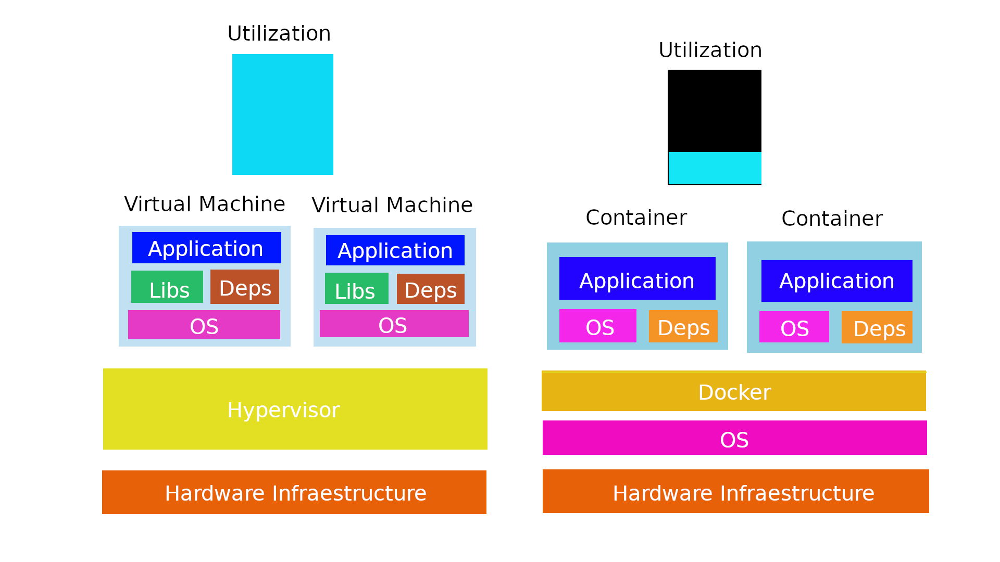

# Containers vs Virtual Machines

- **Run start a container, pull if not exist image**  
docker run *image*

- **List containers**  
docker ps -a

- **Docker stop**  
docker stop *container*

- **Remove a container**  
docker rm *container*

- **List images**  
docker images

- **Remove images**  
docker rmi *image*

- **Run STDIN**  
docker run -i *image*

- **Port mapping**  
docker run -p *locahostport*:*containerport* *image*

- **Volume mapping**  
docker run -v /**hostpath**:/**containerpath** *image*

- **Inspect Container**  
docker inspect **container**
